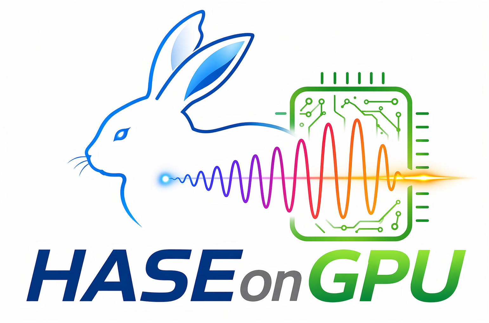

HASEonGPU Documentation
=======================

HASEonGPU (**H**\ igh performance **A**\ mplified **S**\ pontaneous **E**\ mission on **GPU**) is an
open-source HPC software for calculating amplified spontaneous emission (ASE)
flux in laser gain media.

It is intended to support the design and analysis of high-power laser systems,
where ASE is an important limiting effect for stored energy, gain distribution,
and overall amplifier performance.

For installation and usage see :doc:`Getting Started <gettingStarted>`.

Contents
--------

.. toctree::
   :maxdepth: 2
   :caption: Documentation

   gettingStarted
   binaryInterface
   MATLABInterface
   pythonInterface

Scientific Background
---------------------

HASEonGPU builds on earlier ASE modeling work by D. Albach et. al [2],
where ray-tracing techniques and Monte Carlo integration were used to calculate
ASE in laser gain media in a single-threaded cpu-centered context. Based on this scientific foundation, HASEonGPU [1] extends
the approach with multi-GPU acceleration, adaptive sampling, and distributed multi-node execution.

Nature of the problem
^^^^^^^^^^^^^^^^^^^^^

Accurate ASE simulations require a large number of sampling points as well as a
high number of rays. In addition, reflections on the upper and lower surfaces of
the gain medium can substantially increase the computational workload. On
traditional CPU-based systems, this makes detailed ASE simulations
time-consuming and limits the number of practical simulation runs.

Solution method
^^^^^^^^^^^^^^^

HASEonGPU addresses this by combining a non-uniform spatial sampling of the
gain medium with Monte Carlo integration, importance sampling, adaptive
sampling, and GPU parallelization[1]. The code also supports execution on GPU
clusters, where the workload is distributed across multiple GPUs using MPI in a
master-worker scheme.

Restrictions
^^^^^^^^^^^^

The number of rays used for the Monte Carlo integration of a single sampling
point is limited by the available GPU memory.

Features
^^^^^^^^

HASEonGPU can run both on a single workstation in threaded mode and on larger
GPU clusters in MPI mode. The simulation supports features such as
polychromatic laser pulses, cladding, surface coatings, refractive indices, and
reflections on the upper and lower surfaces of the gain medium. If a target
mean squared error is not reached with the current number of rays, the
algorithm can automatically increase the sampling effort.

References
----------
[1] C.H.J. Eckert, E. Zenker, M. Bussmann, and D. Albach,
    *HASEonGPU—An adaptive, load-balanced MPI/GPU-code for calculating the
    amplified spontaneous emission in high power laser media*,
    Computer Physics Communications, 207, 2016, 362–374.
    DOI: `10.1016/j.cpc.2016.05.019`

[2] D. Albach, J.-C. Chanteloup, G. l. Touzé,
    *Influence of ASE on the gain distribution in large size, high gain
    Yb3+:YAG slabs*,
    Optics Express, 17(5), 2009, 3792–3801.
